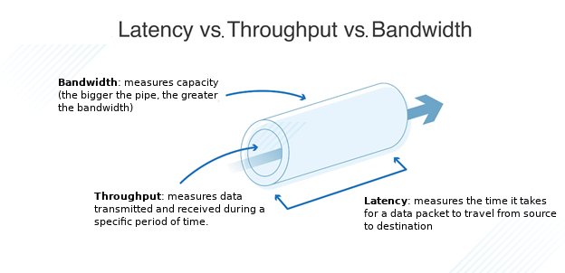
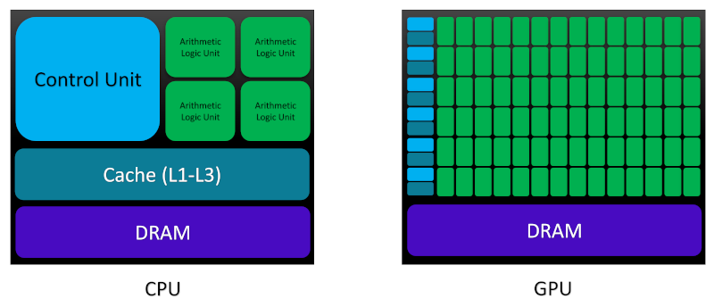

> ## Table of Contents
> - [1. Background](#1-background)
> - [2. Parallel Programming Paradigms](#2-parallel-programming-paradigms)
> - [3. CUDA: A Platform for Heterogeneous Parallel Programming](#3-cuda-a-platform-for-heterogeneous-parallel-programming)
> - [4. CPU vs GPU Performance and Precision](#4-cpu-vs-gpu-performance-and-precision)
{: .prereq}

## 1. Background

**High-performance computing (HPC)** is a highly multi-disciplinary area of research
at the intersection of computing systems, hardware architectures, software platforms
and parallel programming paradigms. The main goal of HPC is to deliver high-troughput 
and efficient solutions to computationally expensive problems via simultaneous use
of multiple computational processing units.
The invention of **graphics processing units (GPUs)** more than two decades 
ago by NVIDIA was followed by significant improvements in both GPU architecture and
software design. During this period, NVIDIA has introduced a new GPU architecture in
roughly every 2 years: Tesla (2007), Fermi (2009), Kepler (2012), Maxwell (2014),
Pascal (2016), Volta (2017), Turing (2018), and Ampere (2020). The aforementioned
GPU architectures are often a part of the following production line families:

- **Tegra**: designed for mobile and embedded devices such as smart phones and tablets
- **Geforce and Titan**: built for consumer-oriented graphics and entertainment tasks
- **Quadro**: created for professional visualization
- **Tesla**: optimized for technical and scientific computing
- **Jetson**: suitable for artificial intelligence (AI)-driven autonomous machines

<!-- + **AGX Xavier** and **Xavier NX** (Compute Capability = 7.2) Vol
+ **Nano** (Compute Capability = 5.3) Maxwell architecture
+ **TX2** (Compute Capability = 6.2) Pascal architecture
+ **TX1** (Compute Capability = 5.3) Maxwell G
+ **X1** (Compute Capability = 5.3) Tegra GPU -->

As detailed in the [Software/Hardware Specifications]({{ site.baseurl }}#sh-specifications)
section, we will use two CUDA-enabled GPU devices from the GeForce family 
with Kepler and Turing micro-architectures throughout this tutorial.

## 2. Parallel Programming Paradigms

A programmer might see a program as a construct comprised of
*data* and *instructions*. In the absence of *data dependency*
between a set of instructions, *e.g.*, where the resulting data 
generated by an instruction from the first *task* is not required 
for performing another instruction in a second task, the sequential 
(serial) code can run as a *parallel program* and perform 
the aforementioned (data-)independent tasks, concurrently.
Therefore, two fundamental types of parallelism can be realized
for each program: (i) **task parallelism**, and (ii) **data parallelism**.
Task parallelism is based on distribution of independent instructions on 
multiple processing units mainly because some functionalities and instructions
in the code might be able to operate independently. Meanwhile, data parallelism
delocalizes the data across a group of processing units because multiple processors 
can concurrently operate on the data corresponding to each task.

In order to write a parallel code, **homogeneous parallel programming**
is often adopted, in which one or multiple processing units of the same architecture type
perform the tasks concurrently. However, the **heterogeneous parallel programming**
offers a rigorous alternative where processing units from multiple architecture
types are responsible for performing parallelization. Here, GPUs perform the
data-intensive tasks and **central processing units (CPUs)** perform the 
instruction-intensive operations in order to improve the overall performance
compared with both sequential and homogeneous parallel programming models.

To better understand the concept of heterogeneous parallel programming,
we will introduce the following concepts from computer networking:

- **Latency**: The duration of an operation from its beginning to its completion expressed in units of time e.g. microseconds (*m*s)
- **Bandwidth**: The *theoretical* capacity of how much data could be transferred from source to destination per unit of time,
  commonly expressed in gigabytes per second (*G*B/s) for GPUs  
- **Throughput**: The *real* measure of how much data is successfully transferred from source to destination per unit of time, 
expressed in gigaflops (*G*flops) for GPUs, which translates into a billion floating-point operations per second. Therefore, throughput 
is always less than the bandwidth.

One way of qualitatively understanding the 3 concepts is by visualizing water flowing through a pipe. The water represents "data", and 
the pipe diameter represents the "bandwidth", while the amount of water flowing through the pipe over a period of time
represents the "throughput".

Now, let us compare the main architectural differences between CPUs and GPUs
in order to see the motivation behind heterogeneous parallel computing
in terms of the concepts we just learned, more clearly:

The main memory space in both CPU and GPU architectures is assembled using
**dynamic random access memory (DRAM)**. However, lower-latency memory
units such as cache have been constructed using 
**static random access memory (SRAM)**. CPU cores are armed with a large 
amount of cache space at different levels (L1-L3 and rarely, L4), 
which allows them to reduce the latency in memory access through benefiting from
the *principle of locality* and *speculative execution*. By storing the frequently 
used data in cache and predicting the next instruction through an out-of-order
execution, CPUs attempt to minimize the latency of data access/storage from the memory,
in particular at high-clock speed. From L1 to L3, both memory capacity (or its size)
and the data access latency increase. L1 cache is built on the CPU chip physically 
closer to the processing units than L2 and L3 cache which are built onto the 
motherboard or CPU module. Based on the aforementioned architectural details,
CPUs are best suited for complex logical codes with instruction-intensive dynamical 
workload and short sequences of computational operations.

Armed with thousands of transistors on chip, GPUs are designed to hide the latency through 
*maximizing throughput* by handling large number of concurrently active threads:
when one thread is waiting for fetching the data from memory, other active threads can start the
execution at the same time. NVIDIA calls this type of architecture
**single instruction multiple thread (SIMT)** which highlights its optimization 
for data-intensive computational tasks with simple logical control flow. A PCI-Express bus
connects the CPUs and GPUs.

At this point, we have learned some details about GPU hardware architectures and 
gained some insights into the motivation behind the heterogeneous parallel programming.
Let us focus on the software aspect and see how we can improve the performance 
of our codes by harnessing the power of CPUs and GPUs at the same time.

## 3. CUDA: A Platform for Heterogeneous Parallel Programming

Since its first release in 2007, **compute unified device architecture (CUDA)**
has become the major standard platform for the 
**general-purpose computation using GPU (GPGPU)**, a term coined by
[Mark Harris](https://developer.nvidia.com/blog/author/mharris) highlighting
the non-graphical computational applications performed using GPUs.

CUDA as a heterogeneous parallel programming platform provides the programmer with access
to the programmable GPU threads through compiler directives, application programming 
interfaces (APIs), standard programming language extensions such as C, C++, Python, 
Fortran *etc.*, and CUDA-accelerated libraries. As a programming model, CUDA exposes 
both **thread** and **memory hierarchies** which enables user to have a great amount of 
control over GPU threads and memories. We will discuss these concepts in more details in 
the next few lessons.

CUDA development environment also provides some tools for creating GPU-accelerated
programs, including: GPU management tools, *NVIDIA Nsight* integrated development 
environment (IDE), *CUDA-GDB* for debugging via command line interface, 
visual and command-line variants of profiling tools for performance analysis, and 
*CUDA-MEMCHECK* for memory analysis.

## 4. CPU vs GPU Performance and Precision

The core idea behind GPGPUs is to optimize for throughput instead of latency. However, this does not
always guarantee faster execution. One of the limiting factors is the degraded performance of double precision floating point
operations (flops) on GPUs. For instance, consumer GPUs like Nvidia's GTX and RTX series are typically tuned for single precision flops.
Running computations in double precision with these devices can significantly degrade the performance. Furthermore, GPU 
devices with compute capability 1.2 and below support single precision only and not all operations in single precision on these GPUs 
are IEEE 754 accurate. Therefore, it is always recommended to run any GPU computation in the precision that the device is best optimized for.

**-> [!Need to improve and expand on this a bit]**

**-> [!Talk about runtime vs driver API in section 5?]**

