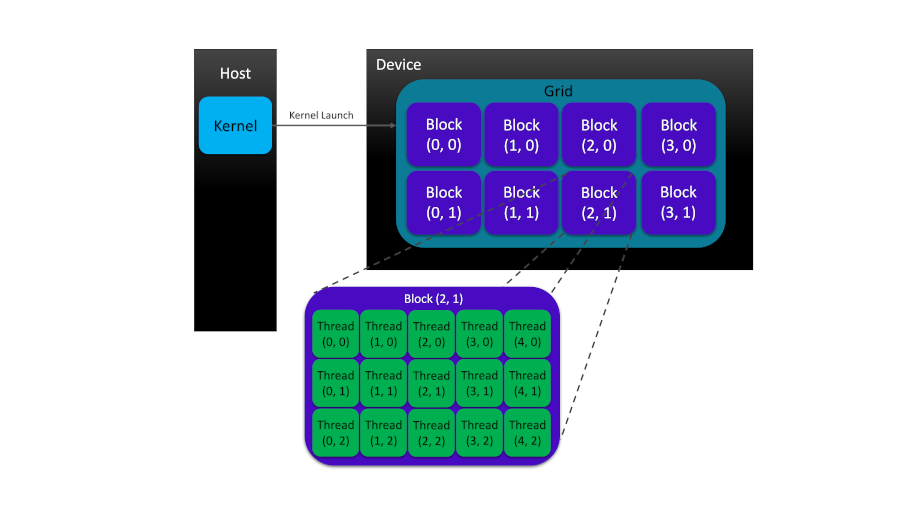

<script type="text/javascript" async
  src="https://cdn.mathjax.org/mathjax/latest/MathJax.js?config=TeX-AMS-MML_HTMLorMML">
</script>

> ## Table of Contents
> - [1. Basics of the Device Memory Management in CUDA](#1-basics-of-the-device-memory-management-in-cuda)
> - [2. Thread Hierarchy in CUDA](#2-thread-hierarchy-in-cuda)
> - [3. Summation of Arrays on GPUs](#3-summation-of-arrays-on-gpus)
>   - [3.1. Header Files and Function Definitions](#31-header-files-and-function-definitions)
>   - [3.2. Structure of the Program](#32-structure-of-the-program)
{: .prereq}

Our [Hello World example]({{site.baseurl}}#1-writing-our-first-cuda-program)
from previous lesson lacks two important aspects of a CUDA program that are 
crucial for CUDA programmers: memory and thread hierarchies. Our next example will demonstrate
the summation of two arrays on GPUs but before proceeding with our example, we need to learn
how to manage the device memory and organize threads. In the following, we present some of the most
frequently used functions from CUDA runtime API collection that will be used in our array 
summation case study.

## 1. Basics of the Device Memory Management in CUDA

In our array summation example, (and in many other scientific applications, in general), 
we will follow a typical pattern in CUDA programming which can be formulated in a series of steps
as follows:

1. Transferring the data from host to device
2. Kernel execution on the device
3. Moving the results back from device to host

As we mentioned previously, most CUDA programs have at least two code domains:
(i) the host code domain which runs on the host (CPU and its memory), and (ii) the device code
domain which is executed on the device (GPU and its memory). The separation (and localization)
of data processes in each domain with different architecture type requires a specific strategy for
memory management and data transfer between the two processing units. As such, CUDA provides
convenient runtime APIs that allow the user to *allocate* or *deallocate* the device memory 
and *transfer* data between host and device memories.

|                           **C/C++**                            |                                                                     **CUDA**                                                                      |        **Description**        |
| :------------------------------------------------------------: | :-----------------------------------------------------------------------------------------------------------------------------------------------: | :---------------------------: |
|   [malloc()](https://en.cppreference.com/w/c/memory/malloc)    | [cudaMalloc()](https://docs.nvidia.com/cuda/cuda-runtime-api/group__CUDART__MEMORY.html#group__CUDART__MEMORY_1g37d37965bfb4803b6d4e59ff26856356) | Allocate uninitialized memory |
| [memset()](https://en.cppreference.com/w/c/string/byte/memset) | [cudaMemset()](https://docs.nvidia.com/cuda/cuda-runtime-api/group__CUDART__MEMORY.html#group__CUDART__MEMORY_1gf7338650f7683c51ee26aadc6973c63a) |       Initialize memory       |
|     [free()](https://en.cppreference.com/w/c/memory/free)      |  [cudaFree()](https://docs.nvidia.com/cuda/cuda-runtime-api/group__CUDART__MEMORY.html#group__CUDART__MEMORY_1ga042655cbbf3408f01061652a075e094)  |       Deallocate memory       |
| [memcpy()](https://en.cppreference.com/w/c/string/byte/memcpy) | [cudaMemcpy()](https://docs.nvidia.com/cuda/cuda-runtime-api/group__CUDART__MEMORY.html#group__CUDART__MEMORY_1gc263dbe6574220cc776b45438fc351e8) |          Copy memory          |

As the table above demonstrates, CUDA adopts a convenient naming style for C/C++ functions
and syntax extensions making it easier for the programmer to manage memory on GPU devices.
NVIDIA adopts **lowerCamelCase** (Java style) naming style for its CUDA C/C++ extension APIs.
Here, the `cudaMalloc()` function with the following syntax

```
__host__ __device__ cudaError_t cudaMalloc(void** devPtr, size_t size)
```
{: .language-cuda}

allocates `size` bytes of linear memory on the device pointed to by the `devPtr` double-pointer
variable. As mentioned previously, the `__host__` and `__device__` qualifiers can be used 
together should the kernel be compiled for both host and device.

> ## Note:
> All CUDA function APIs (except kernel launches) return an error value of 
> [enumerated type](https://docs.nvidia.com/cuda/cuda-runtime-api/group__CUDART__TYPES.html#group__CUDART__TYPES_1g3f51e3575c2178246db0a94a430e0038), [`cudaError_t`](https://docs.nvidia.com/cuda/cuda-runtime-api/group__CUDART__TYPES.html#group__CUDART__TYPES_1gf599e5b8b829ce7db0f5216928f6ecb6).
{: .discussion}

With the memory being allocated on the device, the `cudaMemcpy()` function, with 
the following signature,

```
__host__ cudaError_t cudaMemcpy(void* dst, const void* src, size_t count, cudaMemcpyKind kind)
```
{: .language-cuda}

can be adopted to transfer `count` bytes of data from source memory, pointed to by `src`
pointer, to the destination memory address, pointed to by `dst`. The direction of data
transfer is inferred from the value of the variable, `kind`, of cuda memory enumeration type,
[`cudaMemcpyKind`](https://docs.nvidia.com/cuda/cuda-runtime-api/group__CUDART__TYPES.html#group__CUDART__TYPES_1g18fa99055ee694244a270e4d5101e95b),
which can take one of the following values:

- cudaMemcpyHostToHost
- cudaMemcpyHostToDevice
- cudaMemcpyDeviceToHost
- cudaMemcpyDeviceToDevice
- cudaMemcpyDefault

CUDA recommends passing `cudaMemcpyDefault` to `cudaMemcpy()` function call, in which case, the
transfer direction is automatically chosen based upon the pointer values `scr` and `dst`. 
Note that `cudaMemcpyDefault` should only be adopted when [*unified virtual 
addressing (UVA)*](https://www.google.com/url?sa=t&rct=j&q=&esrc=s&source=web&cd=&cad=rja&uact=8&ved=2ahUKEwiJ9rD787ruAhXkQ98KHVYMAI0QFjAAegQIARAC&url=https%3A%2F%2Fdeveloper.download.nvidia.com%2FCUDA%2Ftraining%2Fcuda_webinars_GPUDirect_uva.pdf&usg=AOvVaw0h8XB32gYKtSmfEwEaFcbQ) is supported.

> ## Note:
> Most kernel launches we consider in this tutorial are *asynchronous* in their behavior in which
> case the control flow is immediately returned to the host after kernel execution. However,
> some function calls, such as `cudaMemcpy()`, are *synchronous*-- the host application stops until
> the function completes its task.
{: .discussion}

## 2. Thread Hierarchy in CUDA

CUDA exposes a two-level thread hierarchy, consisting of **block of threads** and 
**grids of blocks**, to the programmer in order to allow for thread organization
on GPU devices.



As figure demonstrates, each grid is often constructed from many thread blocks.
Each block is a group of threads invoked by kernel to perform a specific task
in parallel. Each thread in a block has its own private local memory space.
However, threads in a block can cooperate to perform the same task in parallel
thanks to the shared memory space in the block which makes data visible to all
threads in the block for the life time of that block. The cooperation between threads
not only can happen in terms of sharing the data and access to it within the block-local
shared memory space but also can be realized in the form of block-level thread synchronization. 

Within the aforementioned two-level thread hierarchy, each thread can be identified with
two parameters:

- `threadIdx`: which refers to the thread index within each block
- `blockIdx`: which stands for the block index within each grid

Both `threadIdx` and `blockIdx` identifiers are 
[built-in structure variables](https://docs.nvidia.com/cuda/cuda-c-programming-guide/index.html#built-in-variables)
of integer-based vector-type, `uint3`, assigned to each thread by CUDA 
runtime application. The internal assignment of these variables are driven by kernel 
execution which makes them accessible to that kernel. Components of the `threadIdx` or `blockIdx`
structure variables, *i.e.*, `threadIdx.x`, `threadIdx.y`, and `threadIdx.z` as well as 
`blockIdx.x`, `blockIdx.y`, and `blockIdx.z` allow for a three-dimensional organization of
blocks and grids in CUDA. The dimensions of grids of blocks and bocks of threads can be
controlled via the following CUDA built-in variables, respectively

- `gridDim`: which refers to the grids of block object dimension
- `blockDim`: which indicates the block of threads' dimension

The `blockDim` and `gridDim` variables are structures of `dim3` type with x, y, z fields
for Cartesian components.

Let's write a simple kernel that shows how blocks of threads and grids of blocks can be 
organized and identified in a CUDA program:

```
#include <cuda_runtime.h>
#include <stdlib.h>
#include <stdio.h>

__global__ void printThreadID() {
    /* For each thread, the kernel prints
     * the threadIdx, blockIdx, blockDim,
     * and gridDim, respectively.
     */
    printf("threadIdx:(%d, %d, %d), \
            blockIdx:(%d, %d, %d), \
            blockDim:(%d, %d, %d), \
            gridDim:(%d, %d, %d)\n", \
            threadIdx.x, threadIdx.y, threadIdx.z, \
            blockIdx.x, blockIdx.y, blockIdx.z, \
            blockDim.x, blockDim.y, blockDim.z, \
            gridDim.x, gridDim.y, gridDim.z);

}

int main(int argc, char **argv)
{
    /* Array size */
    int numArray  = 6;

    /* Number of threads in blocks */
    int numBlocks = 2;

    /* Organizing grids and blocks */
    dim3 block(numBlocks);
    dim3 grid((numArray + block.x - 1) / block.x);

    /* Let the user know that the dimensions will be printed from the host */
    printf("Printing from the host!\n");

    /* Print the grid and block dimensions from the host */
    printf("[grid.x, grid.y, grid.z]:    [%d, %d, %d]\n", grid.x, grid.y, grid.z);
    printf("[block.x, block.y, block.z]: [%d, %d, %d]\n\n", block.x, block.y, block.z);

    /* Indicate that the dimensions will now be printed from the device */
    printf("Printing from the device!\n");

    /* Print the grid and block dimensions from the device */
    printThreadID<<<grid, block>>>();

    /* Performing house-keeping for the device */
    cudaDeviceReset();

    return(EXIT_SUCCESS);
}
```
{: .language-cuda}

Running this code will generate the following output:

```
Printing from the host!
[grid.x, grid.y, grid.z]:    [3, 1, 1]
[block.x, block.y, block.z]: [2, 1, 1]

Printing from the device!
threadIdx:(0, 0, 0),             blockIdx:(0, 0, 0),             blockDim:(2, 1, 1),             gridDim:(3, 1, 1)
threadIdx:(1, 0, 0),             blockIdx:(0, 0, 0),             blockDim:(2, 1, 1),             gridDim:(3, 1, 1)
threadIdx:(0, 0, 0),             blockIdx:(2, 0, 0),             blockDim:(2, 1, 1),             gridDim:(3, 1, 1)
threadIdx:(1, 0, 0),             blockIdx:(2, 0, 0),             blockDim:(2, 1, 1),             gridDim:(3, 1, 1)
threadIdx:(0, 0, 0),             blockIdx:(1, 0, 0),             blockDim:(2, 1, 1),             gridDim:(3, 1, 1)
threadIdx:(1, 0, 0),             blockIdx:(1, 0, 0),             blockDim:(2, 1, 1),             gridDim:(3, 1, 1)
```
{: .output}

Now, let's get back to our code and analyze it step by step
in order to understand the mechanistic details of thread
organization in CUDA programming. First, you might have noticed
that we have included ***cuda_runtime.h*** header file in addition to 
***stdio.h*** and ***stdlib.h*** that provide access to `printf()` functions
and status macros in C, respectively. The 
[CUDA runtime API](https://docs.nvidia.com/cuda/cuda-runtime-api/index.html) 
manages the kernel loads, parameter passes and configurations
before kernel execution. CUDA runtime consists of two main parts:
(i) a C-style function interface (*cuda_runtime_api.h*),
and (ii) a C++-style interface (*cuda_runtime.h*) built upon C-APIs
as wrapper extensions for programming convenience.
As long as our codes are compiled with **nvcc**, it manages the 
inclusion of CUDA runtime API headers for us. So, you can try even
removing the ***cuda_runtime.h*** header from the code but it still compiles
without any issues. The structure of the [CUDA runtime API](https://docs.nvidia.com/cuda/cuda-runtime-api/index.html) 
is detailed in the CUDA Toolkit [documentation](https://docs.nvidia.com/cuda/index.html).

The next part of our code defines the `printThreadID()` kernel 
implementation which is comprised of a single function call to the formatted
print function, `printf()`. Our code demonstrates that there are two 
different sets of grid and block identification variables:
(i) user-defined variables of type `dim3` that are defined and visible 
on the host side, only,

```
dim3 block(numBlocks);
dim3 grid((numArray + block.x - 1) / block.x);
```
{: .language-cuda}

and (ii) the built-in thread, block and grid identification variables of 
the type `uint3` which will be visible on the device and therefore accessible
within the kernel function.

We previously mentioned that the structures of `dim3` type have three 
fields but in this case, only one value has been passed to both block 
and grid object constructors' argument lists.
As such, the other two undefined variables are automatically initialized 
to 1 and ignored (See the output above). It is important to note that the
number of grids in each direction (*i.e.*, x, y, z) is dependent on the 
number of threads in blocks through the following formula:

$$ \tag{1}\label{EQ:THRDORG}
\text{grids}.q = \left(\frac{\text{numberOfElements} + \text{block}.q - 1}{\text{block}.q}\right), \qquad \quad \text{where} \qquad q = x, y, z 
$$

In the next part of our code, we then access the block and grid dimension variables 
within the main function to print them to the screen from the host.

```
printf("[grid.x, grid.y, grid.z]:    [%d, %d, %d]\n", grid.x, grid.y, grid.z);
printf("[block.x, block.y, block.z]: [%d, %d, %d]\n\n", block.x, block.y, block.z);
```
{: .language-cuda}

After that, the grid and block objects can be passed to the kernel execution
configuration as arguments:

```
printThreadID<<<grid, block>>>();
```
{: .language-cuda}

The kernel execution triggers the initialization of the built-in thread, 
block and grid identification variables of the type `uint3` by the CUDA runtime
which will be visible and accessible to the kernel functions on the device side.

~~~
__global__ void printThreadID() {
    /* For each thread, the kernel prints
     * the threadIdx, blockIdx, blockDim,
     * and gridDim, respectively.
     */
    printf("threadIdx:(%d, %d, %d), \
            blockIdx:(%d, %d, %d), \
            blockDim:(%d, %d, %d), \
            gridDim:(%d, %d, %d)\n", \
            threadIdx.x, threadIdx.y, threadIdx.z, \
            blockIdx.x, blockIdx.y, blockIdx.z, \
            blockDim.x, blockDim.y, blockDim.z, \
            gridDim.x, gridDim.y, gridDim.z);
}
~~~
{: .language-cuda}

When each active thread runs the kernel, it has access to the aforementioned pre-initialized 
identification indices. Therefore, the kernel function `printThreadID()` can print the thread 
identifiers to the screen. Note that in order to improve readability, we have used  backslashes, '\\',
to split a long function argument list in `printf()` function call into multiple lines of code.
Finally, we call the `cudaDeviceReset()` function to destroy all allocated memory addresses on the device
and restart its state within the current process.

## 3. Summation of Arrays on GPUs

Copy the following code into an empty text file, rename it to ***gpuVectorSum.cu*** and save it.

```
/*================================================*/
/*================ gpuVectorSum.cu ===============*/
/*================================================*/
#include <stdlib.h>
#include <stdio.h>
#include <stdbool.h>
#include <time.h>
#include <sys/time.h>
#include <cuda_runtime.h>

/*************************************************/
inline double chronometer() {
    struct timezone tzp;
    struct timeval tp;
    int tmp = gettimeofday(&tp, &tzp);
    return ((double)tp.tv_sec + (double)tp.tv_usec * 1.e-6);
}
/*-----------------------------------------------*/
void dataInitializer(float *inputArray, int size) {
    /* Generating float-type random numbers 
     * between 0.0 and 1.0
     */
    time_t t;
    srand( (unsigned int) time(&t) );

    for (int i = 0; i < size; i++) {
        inputArray[i] = ( (float)rand() / (float)(RAND_MAX) ) * 1.0;
    }

    return;
}
/*-----------------------------------------------*/
void arraySumOnHost(float *A, float *B, float *C, const int size) {
    for (int i = 0; i < size; i++) {
        C[i] = A[i] + B[i];
    }
}
/*-----------------------------------------------*/
__global__ void arraySumOnDevice(float *A, float *B, float *C, const int size) {
    int idx = blockIdx.x * blockDim.x + threadIdx.x;
    if (idx < size) { 
        C[idx] = A[idx] + B[idx];
    }
}
/*-----------------------------------------------*/
void arrayEqualityCheck(float *hostPtr, float *devicePtr, const int size) {
    double tolerance = 1.0E-8;
    bool isEqual = true;

    for (int i = 0; i < size; i++) {
        if (abs(hostPtr[i] - devicePtr[i]) > tolerance) {
            isEqual = false;
            printf("Arrays are NOT equal because:\n");
            printf("at %dth index: hostPtr[%d] = %5.2f \
            and devicePtr[%d] = %5.2f;\n", \
            i, i, hostPtr[i], i, devicePtr[i]);
            break;
        }
    }

    if (isEqual) {
        printf("Arrays are equal.\n\n");
    }
}
/*************************************************/
int main(int argc, char **argv) {
    printf("Kicking off %s\n\n", argv[0]);

    /* Device setup */
    int deviceIdx = 0;
    cudaSetDevice(deviceIdx);

    /* Device properties */
    cudaDeviceProp deviceProp;
    cudaGetDeviceProperties(&deviceProp, deviceIdx);
    printf("GPU device %s with index (%d) is set!\n\n", \
    deviceProp.name, deviceIdx);
/*-----------------------------------------------*/
    /* Fixing the vector size to 1 * 2^24 = 16777216 (64 MB) */
    int vecSize = 1 << 24;
    size_t vecSizeInBytes = vecSize * sizeof(float);
    printf("Vector size: %d floats (%lu MB)\n\n", vecSize, vecSizeInBytes/1024/1024);

    /* Memory allocation on the host */
    float *h_A, *h_B, *hostPtr, *devicePtr;
    h_A     = (float *)malloc(vecSizeInBytes);
    h_B     = (float *)malloc(vecSizeInBytes);
    hostPtr = (float *)malloc(vecSizeInBytes);
    devicePtr  = (float *)malloc(vecSizeInBytes);

    double tStart, tElapsed;

    /* Vector initialization on the host */
    tStart = chronometer();
    dataInitializer(h_A, vecSize);
    dataInitializer(h_B, vecSize);
    tElapsed = chronometer() - tStart;
    printf("Elapsed time for dataInitializer: %f second(s)\n", tElapsed);
    memset(hostPtr, 0, vecSizeInBytes);
    memset(devicePtr,  0, vecSizeInBytes);

    /* Vector summation on the host */
    tStart = chronometer();
    arraySumOnHost(h_A, h_B, hostPtr, vecSize);
    tElapsed = chronometer() - tStart;
    printf("Elapsed time for arraySumOnHost: %f second(s)\n", tElapsed);
/*-----------------------------------------------*/
    /* (Global) memory allocation on the device */
    float *d_A, *d_B, *d_C;
    cudaMalloc((float**)&d_A, vecSizeInBytes);
    cudaMalloc((float**)&d_B, vecSizeInBytes);
    cudaMalloc((float**)&d_C, vecSizeInBytes);

    /* Data transfer from host to device */
    cudaMemcpy(d_A, h_A, vecSizeInBytes, cudaMemcpyHostToDevice);
    cudaMemcpy(d_B, h_B, vecSizeInBytes, cudaMemcpyHostToDevice);
    cudaMemcpy(d_C, devicePtr, vecSizeInBytes, cudaMemcpyHostToDevice);

    /* Organizing grids and blocks */
    int numThreadsInBlocks = 1024;
    dim3 block (numThreadsInBlocks);
    dim3 grid  ((vecSize + block.x - 1) / block.x);

    /* Execute the kernel from the host*/
    tStart = chronometer();
    arraySumOnDevice<<<grid, block>>>(d_A, d_B, d_C, vecSize);
    cudaDeviceSynchronize();
    tElapsed = chronometer() - tStart;
    printf("Elapsed time for arraySumOnDevice <<< %d, %d >>>: %f second(s)\n\n", \
    grid.x, block.x, tElapsed);
/*-----------------------------------------------*/
    /* Returning the last error from a runtime call */
    cudaGetLastError();

    /* Data transfer back from device to host */
    cudaMemcpy(devicePtr, d_C, vecSizeInBytes, cudaMemcpyDeviceToHost);

    /* Check to see if the array summations on 
     * CPU and GPU yield the same results 
     */
    arrayEqualityCheck(hostPtr, devicePtr, vecSize);
/*-----------------------------------------------*/
    /* Free the allocated memory on the device */
    cudaFree(d_A);
    cudaFree(d_B);
    cudaFree(d_C);

    /* Free the allocated memory on the host */
    free(h_A);
    free(h_B);
    free(hostPtr);
    free(devicePtr);

    return(EXIT_SUCCESS);
}
```
{: .language-cuda}

After saving the code, it can be compiled and run using the following two commands

```
$ nvcc gpuVectorSum.cu -o gpuVectorSum
$ ./gpuVectorSum
```
{: .language-bash}

with the output similar to the following

```
Kicking off ./test

GPU device "GeForce GTX 1650" with index "0" is set!

Vector size: 16777216 floats (64 MB)

Elapsed time for dataInitializer: 0.757348 second(s)
Elapsed time for arraySumOnHost: 0.062009 second(s)
Elapsed time for arraySumOnDevice <<< 16384, 1024 >>>: 0.001885 second(s)

Arrays are equal.
```
{: .output}

In this case, wall-time measurements indicate that the `arraySumOnDevice()`
executes more than ten times faster than `arraySumOnHost()`. Since the 
size of arrays we used are very small compared to what makes such measurements
relevant and useful from practical perspective, we do not
intend overstate the importance of these timings and observed savings. 
Another major problem with this code is its length. 
In the next lesson, we are going to restructure this code by breaking 
it into multiple source files when we talk a little bit about the nvcc compiler.

Now, it is time to focus on our code and start analyzing it from the beginning.

### 3.1. Header Files and Function Definitions

Our vector addition code, involves three additional new headers: (i)
***stdbool.h*** for including the `true` and `false` boolean type definitions,
(ii) ***time.h*** for including `time_t` type and `time()` function definitions, 
and (iii) ***sys/time.h*** for adding the `timeval` and `timezone` 
structure definitions.

In the next section of our code, separated by commented star-shaped lines,
there are four C/C++ function definitions [`chronometer()`, 
`dataInitializer()`, `arraySumOnHost()`, and `arrayEqualityCheck()`] 
and one CUDA kernel implementation `arraySumOnDevice()`. 

The `chronometer()` uses `timezone` and `timeval` structures and 
`gettimeofday()` function -- included by ***sys/time.h***--  to define
a utility function that allow us measure the wall-clock time between 
any two points in our code.

> ## Note:
> The `gettimeofday()` function is supported by GCC compilers and
> might not work on Windows. However, there are multiple ways to perform
> the timing task within C/C++. For further information, see 
> [here](https://levelup.gitconnected.com/8-ways-to-measure-execution-time-in-c-c-48634458d0f9) or
> take a glance at [Advanced Linux Programming Book](https://www.amazon.com/Advanced-Linux-Programming-CodeSourcery-LLC/dp/0735710430) (section 8.7 gettimeofday: Wall-Clock Time).
{: .discussion}

The `dataInitializer()` function accepts pointers to the location of allocated
memories for the input arrays (A and B) on the host and size of the arrays.
The input arrays are then initialized and filled with float-type random
numbers between zero and one.

The `arraySumOnHost()` function, as its name suggests, is responsible for
performing an element-by-element summation of the two arrays, A and B, on 
the host and stores the results into array C. The kernel function
`arraySumOnDevice()` works similar to its CPU counterpart, `arraySumOnHost()`
except in its logistics. Although, `arraySumOnDevice()` kernel is written
for a single thread specified by its thread index variable, `idx`, when
the kernel is launched with a particular kernel execution configuration 
and thread organization, hundreds or thousands of active threads concurrently 
perform the same summation operation on individual elements of the arrays A 
and B and store the results in array C. This time, the A, B and C vectors are 
allocated on device's global memory.

The `arrayEqualityCheck()` function performs an element-by-element comparison
of the resulting vectors returned from `arraySumOnHost()` and 
`arraySumOnDevice()` functions on the host side.

### 3.2. Structure of the Program

The next section of our code involves function calls in the `main()` driver 
function. After fetching the name of the program executable from the command
line and printing it to the screen, CUDA runtime functions are adopted to
set the device and then print its name. Setting the device index will be
useful when the system has multiple devices installed. In a miscellaneous
lesson, we will describe how to choose the best (most powerful) available 
GPU if the host system has multiple GPU accelerator devices installed.

Summation of arrays on the host side starts by specifying the array sizes 
using the [left-shit bitwise operator](https://en.cppreference.com/w/c/language/operator_arithmetic)
and pointer declarations to be able to point to the memory
addresses for arrays A and B when we allocate them on the host 
using the `malloc()` function. In order to be able to distinguish between 
pointers that refer to the memory addresses on the host and the device,
we prepend the prefixes `h_` (for host) or `d_` (for device) to the variable names.
Each of the arrays `h_A` and `h_B` are then passed to `dataInitializer()` function
to be filled with random float numbers. After initialization step, 
the `arraySumOnHost()` function sums both arrays A and B together on the host 
and stores the resulting array in another allocated memory address on the 
host pointed to by the `hostPtr` variable. We adopted `chronometer()` to time 
the initialization and summations steps and printed those timings to the screen.

The next part of the code is similar to the what we did for the summation
of arrays A and B on the host but this time, we adopt CUDA C APIs instead of
those of C/C++. For example, for memory allocation on the device, we use 
`cudaMalloc()` instead of `malloc()`. 

Remember in the [first section](#1-basics-of-the-device-memory-management-in-cuda)
of this lesson, we mentioned that each CUDA program has a series of typical steps in 
order to perform a specific task. After memory allocation-- for arrays `d_A` and
`d_B`-- on the device, we need to initialize them through copying the content of
the corresponding arrays, `h_A` and `h_B`, from the host to their aforementioned 
counterparts on the device via adopting `cudaMemcpy()` functions.
We have just finished the first (out of three) step(s) in a typical CUDA program
where we transferred data from host to device (HtoD) using `cudaMemcpy()`.
Note that the `cudaMemcpy()` is synchronous meaning that the flow of execution on
the host will stop and wait for `cudaMemcpy()` to finish its job. 

The next step is to execute the kernel `arraySumOnDevice()` on the device.
In order to do that, we need to organize our threads in blocks and blocks in grids
from the host so that we can access them on the device within the kernel 
as mentioned in the [previous section](#2-thread-hierarchy-in-cuda). Thread 
organization is one of the most important aspects of CUDA programming model that has
a major impact on the performance of our code. In our intermediate and advanced tutorials,
we will constantly keep an eye on this factor and try to optimize the performance
through finding the best possible configuration of threads in blocks and grids through 
a profiling-driven approach. As Eq. \eqref{EQ:THRDORG} suggests, fixing the number
of threads in each block (`numThreadsInBlocks`) for each block dimension determines 
the number of blocks in the grid for that dimension. Once we have defined the `block` 
and `grid` variables on the host, we pass them to the execution configuration 
`<<<grid, block>>>` as arguments in order to launch the kernel on the device.
Compared with synchronous function calls such as `cudaMemcpy()` where the host 
has to wait until its execution is completed, the kernel launches are asynchronous 
and the execution flow returns to host right after the kernel is executed. 
Since we intend to measure the execution wall-time for `arraySumOnDevice()` 
kernel launch from the host, we need to tell the host to wait for the kernel to complete
its task. This is done by calling `cudaDeviceSynchronize()` from the host right 
after the kernel launch.

When the kernel is launched, thousands of threads gain access to data and resources
on GPU and perform the array summation concurrently. This is the motivation behind
the concept **Single Instruction Multiple Threads (SIMT)** which NVIDIA has coined for
this type of architecture. 

> ## Note:
> The SIMT architecture is very similar to the **Single Instruction
> Multiple Data (SIMD)** variant in 
> [*Flynn's Taxonomy*](https://en.wikipedia.org/wiki/Flynn%27s_taxonomy). However, 
> their main difference is that in SIMD, all elements of an array should be operated 
> upon simultaneously, whereas in SIMT architecture, multiple threads in the same group, 
> while performing the same instruction, execute the operation independently on their 
> own private data.
{: .discussion}

The result of array summation on GPU is stored in another array `d_C` on
device's global memory. The step three of a CUDA program is to transfer
the resulting data back from device to host (DtoH). Before transferring the data,
we make sure that there was no errors in the last CUDA runtime call through 
using [`cudaGetLastError()`](https://docs.nvidia.com/cuda/cuda-runtime-api/group__CUDART__ERROR.html#group__CUDART__ERROR_1g3529f94cb530a83a76613616782bd233). If there was no errors, we transfer the results back to the host using 
`cudaMemcpy()` and store it in host's allocated memory pointed to by `devicePtr` 
variable. Now that we have the summation results from CPU and GPU stored on the 
host memory variables, `hostPtr` and `devicePtr`, respectively, we can compare them 
using `arrayEqualityCheck()` function. The final stage of our program performs
housekeeping by deallocating the memories on both device and host. 

