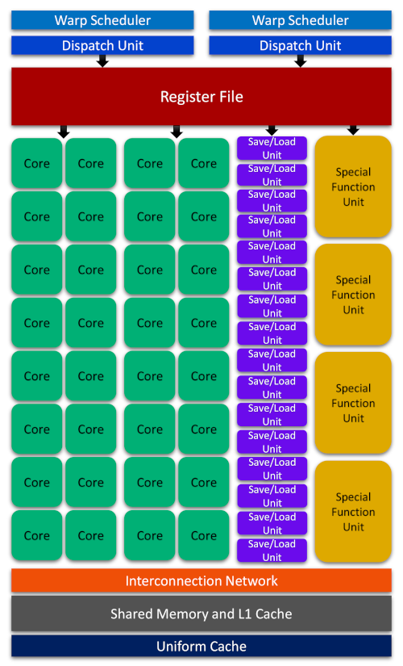

- [1. GPU Architecture](#1-gpu-architecture)
- [2. Profiling Tools](#2-profiling-tools)

## 1. GPU Architecture

We previously mentioned that the sole knowledge of the semantics in CUDA
programming will not probably be enough for achieving the best possible 
performance in practical applications. Today's smart compilers 
can largely mitigate this issue by optimizing our codes. Nevertheless,
writing a CUDA program based on insights about the GPU architecture
and limitations of the device in use, offers significant advantages 
over blind coding and allows for the best possible thread organization 
and kernel configuration to maximize the performance. 
As such, CUDA execution model provides a logical view of thread concurrency
within the SIMT framework and bridges between the **streaming multiprocessors (SMs)**,
as the central building block of GPU architecture, and improvement of memory access
and instruction throughput. 

The SMs partition the thread blocks into units of 32
consecutive threads called **warps** which will be further scheduled for execution 
by *warp schedulers*. Within a warp, the consecutive threads in blocks have unique 
IDs and are indexed in ascending order starting from 0.
For a given thread block, the number of warps can be calculated with the
following formula

$$
\text{WarpsPerBlock} = \bigg\lceil\frac{\text{threadsPerBlock}}{\text{warpSize}}\bigg\rceil,
$$

where *threadsPerBlock* is defined as

$$
\text{threadsPerBlock} = \sum_q \text{block.}q   \qquad \quad \text{where} \qquad    q \in \{x, y, z \}
$$

According to these formulae, a warp is never distributed between different 
thread blocks. CUDA manages valuable and limited resources such as registers
and shared memory on SMs and distributes them among all its threads. The limitations
of these resources affects the number of active warps and the level of SIMT parallelism
that can be realized in a particular SM. As such, in order to maximize GPU utilization
for achieving the best performance through increasing the number of
active warps with respect to the limited resources, 
a proper thread organization and execution configuration would 
be of core importance. For example, if we organize a 2-dimensional 
$4 \times 20$ array of threads in a block (total of 80 threads/block) 
using CUDA on the software side, the device will allocate 3 warps for this
block on the hardware side resulting in the allocation of resources for supporting 96 threads.
However, 16 threads in one of the three warps are inactive while still
burning the allocated resources.

> ## Note:
> Although from the logical point of view, threads
> can be organized within 1-, 2- and 3-dimensional blocks, 
> from hardware perspective, all threads can only exist in a one-dimensional
> world.
{: .discussion}

All threads in a warp execute the same instruction and perform the 
requested operation on their own private data. Therefore, maximum 
efficiency can be realized if all 32 threads are on the same 
execution path. However, the execution of different instructions 
(different execution paths) by threads *within a warp* causes 
**warp divergence**. The diverged threads within a warp will execute
each execution path in serial mode (loss of parallelism) and disable those
threads that took a different execution path. As such, warp divergence should be
avoided at all costs because results in serious performance deterioration.
Note that warp divergence can only happen among the threads of the same warp and
would be irrelevant if threads of different warps are considered.
This fact about the relation between GPU architecture and software performance
should provide a hint regarding the importance of having knowledge about the
hardware aspects and CUDA execution model.

Let's look at the main parts of a Fermi SM to from a logical perspective
to be able to gain some insights about the hardware micro-architectures
in NVDIA GPU devices

With each architecture release, NVIDIA attempts to introduce new technological 
breakthroughs or major improvements over predecessor models. Therefore, although
the essential parts of the figure above remains somewhat similar across
different architectures, each architecture might offer a very different hardware 
design for its SMs. For example, in 
[Turing SM](https://www.nvidia.com/en-us/design-visualization/technologies/turing-architecture/)
series, 16 trillion concurrent floating-point operations and integer operations per second are
supported. Turing also features a unified architecture for enhanced shared memory, L1, and 
texture memory cache. Tensor core processors in Turing architecture accelerate 
deep learning training and inference up to 500 trillion tensor operations per second.
Finally, the evolutionary real-time ray tracing (RT) core performance in Turing architecture 
was improved by about 8 times over its predecessor architecture, Pascal.

## 2. Profiling Tools

